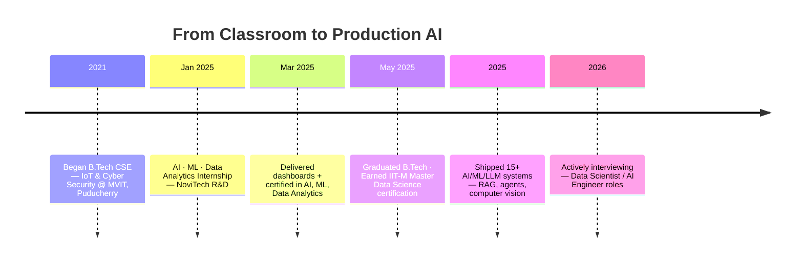

<div align="center">


<br/>

<a href="https://linkedin.com/in/ilavarasan-v-30a036257"></a>
<a href="mailto:ilavarasan.v78@gmail.com"></a>
<a href="https://6a1a851ac6565a81a7418825--beautiful-salamander-3ee0b9.netlify.app/"></a>
<a href="https://github.com/Ilavarasan-v"></a>


</div>

<br/>


## 🧭 Quick Facts

<table width="100%">
<tr>
<td width="50%" valign="top">

🎯 **Focus** — Data Science · ML · LLMs · Agentic AI
📍 **Location** — Puducherry, India · remote-ready
🎓 **Education** — B.Tech CSE (IoT & Cyber Security), MVIT
📜 **Certification** — Master Data Science, IIT-M GUVI / HCL

</td>
<td width="50%" valign="top">

🟢 **Status** — Actively interviewing for Data Scientist / AI Engineer roles
🚀 **Shipped** — 15+ end-to-end AI/ML/LLM projects
🏙️ **Targeting** — Chennai · Bangalore · Remote
📬 **Reach me** — ilavarasan.v78@gmail.com

</td>
</tr>
</table>


## 🧠 About Me

I build AI systems that go past the notebook stage — pipelines where LLMs plan, retrieve, verify, and generate with structured reasoning instead of a single brittle prompt.

Most of my work sits at the intersection of **RAG**, **multi-agent orchestration**, and **applied ML** — and I care as much about the scaffolding around the model (self-evaluation loops, fallback dispatchers, confidence scoring) as the model itself, because that's what makes a system reliable outside a demo.

> *"I thrive at the intersection of data engineering and intelligent systems — from RAG pipelines to agentic AI with structured reasoning."*

<br/>

<div align="center">

</div>


## 🗺️ My Journey




## 📊 Performance Snapshot

| Metric | Value | Project |
|---|---|---|
| RAG Retrieval Accuracy | **88–92%** | CineRAG — 4-stage self-evaluating pipeline |
| Agent Reasoning Accuracy | **~90%** | Multi-Step Reasoning Agent (Planner → Executor → Verifier) |
| Image Classification | **89%** | Multiclass Fish Classifier — ResNet50 transfer learning |
| Inference Speed | **460+ tok/s** | Llama 4 Scout via Groq — Multi-Modal Agent |
| HR Attrition AUC | **~0.74** | XGBoost + SHAP, bias-audited |
| Low-confidence Flag Rate | **< 75%** | DocMind — 5-agent LangGraph pipeline |

<div align="center">

</div>


## 🛠️ Tech Arsenal

**Languages & Data**


**AI · ML · LLMs**


**Frameworks & Tools**


## 🚀 Featured Projects

<table>
<tr>
<td width="50%" valign="top">

### 🎬 CineRAG
**Agentic Movie Recommender**

Self-evaluating 4-stage RAG pipeline: `Plan → Retrieve → Check → Generate`. Query decomposition, ChromaDB + MongoDB hybrid retrieval, LLM scores context 0–10 and retries up to 3× below threshold. GPT-4o-mini primary, Groq Llama 3.3 70B fallback, zero API cost on embeddings.

**► 88–92% retrieval accuracy**
`LangGraph` `ChromaDB` `MongoDB` `OpenAI` `Groq`

</td>
<td width="50%" valign="top">

### 🤖 Multi-Modal AI Agent
**Any image → structured JSON**

Upload a receipt, whiteboard, or product photo, ask anything, and get JSON shaped to that exact image and question — no fixed schema. Runs on Llama 4 Scout via Groq.

**► 460+ tokens/sec inference**
`Llama 4 Scout` `Groq API` `Streamlit`

</td>
</tr>
<tr>
<td width="50%" valign="top">

### 📊 AI-Powered Data Analyst
**Multi-agent CSV analysis**

Four specialized agents: schema/quality inspector → pandas+matplotlib code writer → bug reviewer → plain-English explainer. Groq Llama 3.3 70B with Anthropic Claude Haiku fallback.

**► Auto chart + code + insight per query**
`Groq` `Anthropic` `Pandas` `Matplotlib`

</td>
<td width="50%" valign="top">

### 📄 DocMind
**5-agent document intelligence**

Parser → Orchestrator → QA (RAG + reranking) → Summarizer (map-reduce) → Comparison → Verifier. Confidence-scored 0–100%, flags anything below 75%, page-level citations on every answer.

**► Supports Q&A · Summarize · Compare**
`LangGraph` `ChromaDB` `PyMuPDF` `FastAPI`

</td>
</tr>
</table>

<details>
<summary><b>📁 View all 15 projects</b></summary>
<br/>

| # | Project | Stack | Highlights |
|---|---|---|---|
| 5 | RecallAI — Memory System | Groq · Llama-3.3-70B · ChromaDB · Telegram | Dual memory (episodic JSON + semantic ChromaDB), per-user isolation, cross-session recall |
| 6 | HR Attrition Analytics | XGBoost · SHAP · Streamlit · Docker | AUC ~0.74, SHAP explainability, bias audit, Docker-ready |
| 7 | RAG-Based Q&A System | MongoDB · LangChain · LLM · Streamlit | 50,000+ records, 88–92% retrieval accuracy |
| 8 | Multi-Step Reasoning Agent | OpenAI · Groq · Agentic AI | Planner–Executor–Verifier, ~90% reasoning accuracy |
| 9 | Multiclass Fish Image Classifier | TensorFlow · Keras · ResNet50 | Transfer learning + augmentation, 89% accuracy |
| 10 | AI Study Plan Generator | FastAPI · Streamlit · SQLite · Gemini | Goal → structured daily tasks, persistent tracking |
| 11 | Document Search & Summarization | RAG · FAISS · BM25 · SBERT | Hybrid retrieval, query-focused summaries |
| 12 | Chicago Crime Analyzer | Python · Power BI · PostgreSQL | Hotspot mapping, arrest efficiency, seasonal trends |
| 13 | RedBus Data Scraper | Selenium · MySQL · Pandas | Multi-state coverage, 10 fields/record, filterable UI |
| 14 | Salary Estimation (KNN) | Scikit-learn · Pandas · Matplotlib | Full regression workflow, R² & MAE evaluation |
| 15 | Clickstream Conversion Prediction | Python · ML · EDA · Streamlit | Clickstream behavior → conversion prediction |

</details>


## 💼 Experience

**NoviTech R&D Pvt. Ltd** — AI, ML & Data Analytics Intern · Jan – Mar 2025 · Coimbatore (Remote)
- Built and evaluated end-to-end ML models across 3 course modules — full pipeline from ingestion to evaluation
- Applied 5+ feature engineering techniques across multiple business datasets
- Tuned and compared 3+ model configurations per task with documented performance metrics
- Delivered 2 Power BI dashboards adopted for stakeholder decision-making
- Built reporting pipelines that cut manual data-prep effort across 2 business units


## 🎓 Education & Certifications

| Credential | Institution | Period / Date |
|---|---|---|
| B.Tech CSE — IoT & Cyber Security | Manakula Vinayagar Institute of Technology, Puducherry | 2021–2025 · 8.03 CGPA |
| Master Data Science + Advanced Programming | IIT-M GUVI, Chennai | 2024–2025 |
| Artificial Intelligence, Data Analytics, Machine Learning | NoviTech R&D | Mar 2025 |


## 📈 GitHub Stats & Activity

<div align="center">


</div>


## 🐍 Contribution Snake

<div align="center">

</div>

> ⚙️ To activate this animation: add the `.github/workflows/snake.yml` file (provided separately) to your `Ilavarasan-v/Ilavarasan-v` repo — GitHub Actions will auto-generate the SVG on a daily schedule.


## 🧗 Currently Learning

```
Multi-Agent Orchestration   → LangGraph state machines · tool calling · handoffs
MLOps & Deployment          → Docker · FastAPI · CI/CD for ML pipelines
LLM Fine-Tuning             → LoRA · QLoRA · PEFT · domain instruction tuning
Advanced RAG                → GraphRAG · hybrid BM25+FAISS · re-ranking
```


<div align="center">

### 🟢 Open to remote, hybrid, or relocation — let's talk

<a href="mailto:ilavarasan.v78@gmail.com"></a>
<a href="https://linkedin.com/in/ilavarasan-v-30a036257"></a>
<a href="https://6a1a851ac6565a81a7418825--beautiful-salamander-3ee0b9.netlify.app/"></a>


</div>
